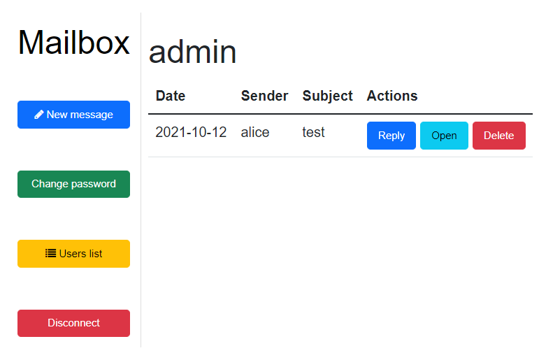
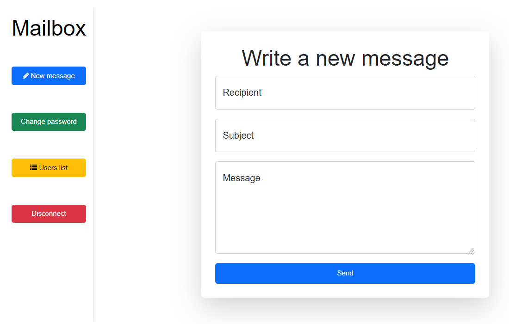
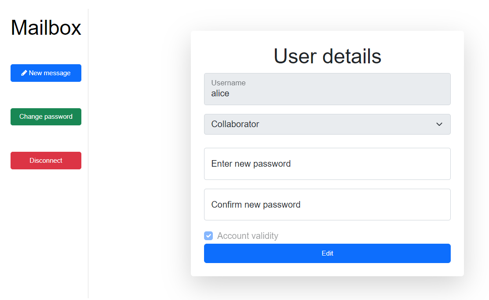
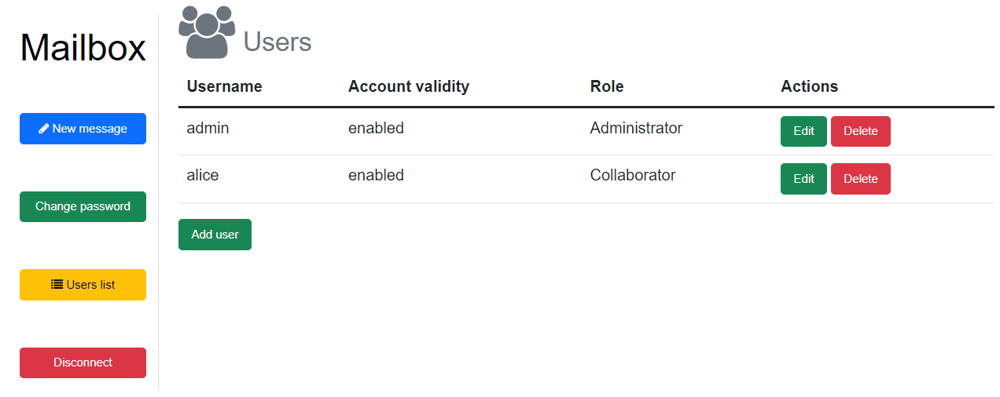
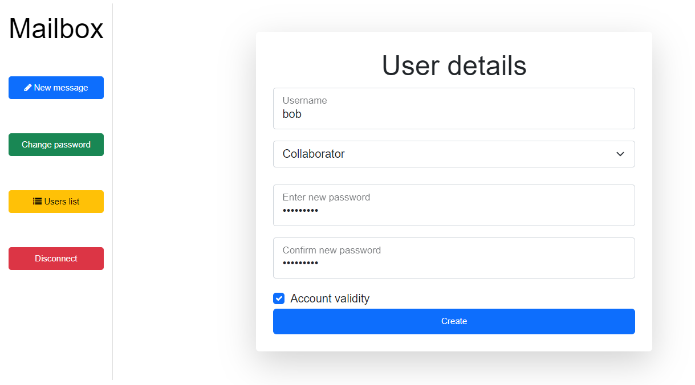
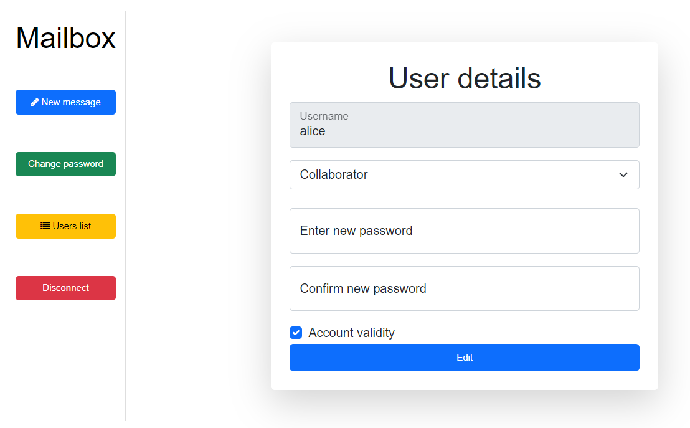
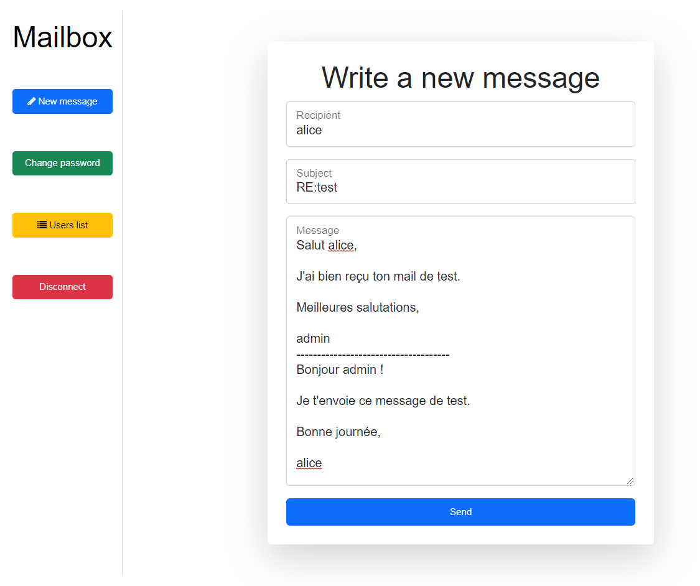
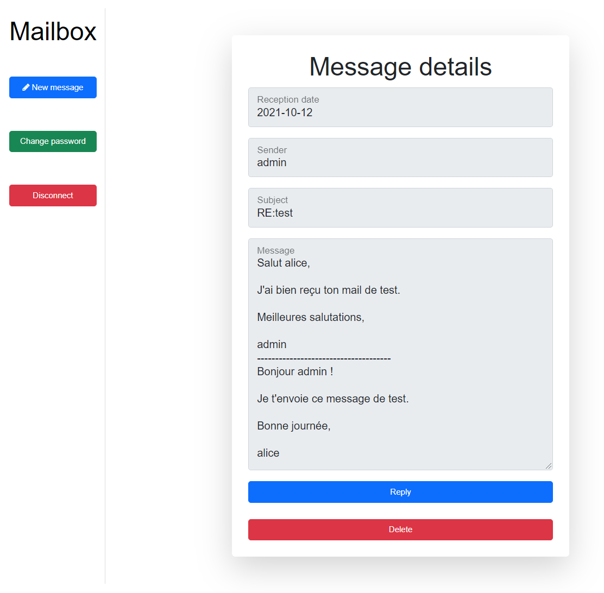

# STI : Projet 2 - Manuel utilisateur

Auteurs : Nicolas Ogi, David Pellissier

Modifié par : Nicolas Ogi, Rebecca Tevaearai

Date : 09.01.2022


## Installation

1. Commencez par cloner ce repository GitHub à l'endroit de votre choix avec la commande :

   `git clone git@github.com:NicolasOgi/STI-Projet2-Ogi-Tevaearai.git`

   Vous devriez obtenir l'arborescence suivante dans le dossier *site* :
   
   ```
   ├───databases
   │       database.sqlite
   │
   └───html
       │   index.php
       │   phpliteadmin.php
       │
       ├───controller
       │       controller.php
       │       details.php
       │       login.php
       │       mailbox.php
       │       message.php
       │       users.php
       │
       ├───css
       │       global.css
       │       login.css
       │       mailbox.css
       │       message.css
       │       users.css
       │
       ├───model
       │       db.php
       │       details.php
       │       login.php
       │       mailbox.php
       │       message.php
       │       users.php
       │
       ├───utils
       │       csrf.php
       │
       └───view
           │   details.php
           │   login.php
           │   mailbox.php
           │   message.php
           │   usermodify.php
           │   users.php
           │
           └───components
                   info_to_user.php
                   password_repeat_check.html
                   sidebar.php
   ```
   
   Comme ce projet a été construit avec un pattern MVC, vous retrouverez les contrôleurs dans le dossier *controller*, les modèles dans le dossier *model* et les vues dans le dossier *view*. Le dossier *components* contient des fichiers utilisés dans certaines vues afin d'afficher des informations à l'utilisateur ou insérer du code HTML. Le dossier *utils* contient un fichier PHP avec une fonction permettant de générer un token anti-CSRF et une autre permettant de le vérifier.  La base de données est fournie avec le projet et est représentée par le fichier *database.sqlite* dans le dossier *databases*. Il est possible d'y accéder via le fichier *phpliteadmin.php* une fois le conteneur Docker et les services démarrés.


## Lancement

2. Pour créer le conteneur Docker, utilisez la commande ci-dessous dans le dossier créé précédemment par la commande `git clone` :

```bash
   docker run -ti -v ${PWD}/site:/usr/share/nginx/ -d -p 8081:80 --name sti_project2 --hostname sti arubinst/sti:project2018
```
Elle permet de télécharger l'image de base *arubinst/sti:project2018* contenant les services nginx et php, de mapper le dossier *site* en local sur le dossier */usr/share/nginx/* dans le conteneur, de mapper le port 8081 local sur le port 80 du conteneur, de nommer le conteneur *sti_project2* ainsi que de nommer l'hôte virtuel *sti*.

   Si le conteneur Docker existe déjà, vous n'avez qu'à le lancer avec la commande : `docker start sti_project2`


3. Lancez les deux services depuis votre host :

```bash
docker exec -u root sti_project2 service nginx start # NGINX
docker exec -u root sti_project2 service php5-fpm start # pour PHP
```

:warning: **ATTENTION** : Avant de lancer les commandes Docker ci-dessus, assurez-vous d'avoir bien installé et lancé le Docker Engine sur votre machine.


4. Changez les droits du fichier `/usr/share/nginx` afin que la base de données puisse être modifiée, avec la commande ci-dessous :

```bash
docker exec -u root sti_project2 chown www-data /usr/share/nginx
```


5. Accédez à la page de login dans votre navigateur en cliquant sur ce lien : [localhost:8081](http://localhost:8081)


## Utilisation

### Page de login


Voici la page de login vous demandant d'entrer un nom d'utilisateur, un mot de passe et de valider le CAPTCHA. 

Deux comptes sont déjà créés, un compte d'administrateur et un compte de collaborateur dont vous trouverez les informations de connexion ci-dessous :

| Nom d'utilisateur | Mot de passe | Rôle           | Validité |
| ----------------- |--------------| -------------- | -------- |
| admin             | @dm1N#9128!  | Administrateur | actif    |
| alice             | 4l1C3%%_x81  | Collaborateur  | actif    |

:warning: **ATTENTION** : La politique de mot de passe impose min. 8 caractères, min. 1 chiffre, min. 1 minuscule, min. 1 majuscule, min. 1 caractère spécial pour former un mot de passe fort lors de la création d'un nouvel utilisateur ou la modification d'un existant.

Dans le cas où le login devait échouer, un message d'information sera affiché en haut à gauche de la page.


### Boîte mail

Une fois connecté, vous arriverez sur cette page représentant une boîte mail :



Le panneau de gauche possède différents boutons permettant d'écrire un nouveau message, de changer son mot de passe, d'accéder à la liste des utilisateurs (bouton affiché seulement pour les comptes ayant le rôle d'Administrateur) et de se déconnecter.

Le panneau de droite affiche le nom de l'utilisateur actuellement connecté ainsi que les mails reçus. Il est possible d'y répondre directement, de l'ouvrir afin d'afficher le corps du message et de le supprimer grâce aux trois boutons situés dans la colonne *Actions*.


### Écrire un nouveau mail

Après avoir appuyé sur le bouton *New message*, la page ci-dessous s'affiche à l'écran : 



Pour envoyer un nouveau mail, il suffit de renseigner un nom d'utilisateur existant dans la base de données et de remplir les champs représentant le sujet et le corps du message. Un message s'affichera en haut à droite pour confirmer que le mail a bien été envoyé.


### Changer son mot de passe

En cliquant sur le bouton *Change password*, il est possible d'accéder aux informations de compte de l'utilisateur connecté afin de modifier son mot de passe : 



Un collaborateur ne pourra que modifier son mot de passe à l'aide de la page ci-dessus. Comparé à un administrateur qui pourrait, en plus, changer son rôle et sa validité. Après changement du mot de passe, un message affiché en haut à gauche de la page de login indiquera que le mot de passe a bien été modifié et l'utilisateur sera invité à se reconnecter avec son nouveau mot de passe.


### Liste des utilisateurs

Un administrateur peut accéder à la liste des utilisateurs en cliquant sur le bouton *Users list* :



Depuis là, il peut modifier, ajouter voire supprimer un utilisateur. Pour revenir dans la boîte mail, il suffit de cliquer sur *Mailbox* en haut à gauche. Un administrateur peut également passer par cette page pour accéder aux informations de son compte et de modifier son mot de passe par exemple en cliquant sur *Edit*.


### Créer un nouvel utilisateur

Lorsqu'un administrateur clique sur le bouton *Add user* en-dessous de la liste des utilisateurs existants, il arrive sur la page ci-dessous :



Elle lui permet de renseigner un nom d'utilisateur, de paramétrer le rôle de celui-ci, de lui définir un mot de passe ainsi que d'activer ou non le compte avec la checkbox. Un message s'affichera en haut à gauche de la page pour indiquer que le compte a bien été créé.


### Modifier un utilisateur existant

Lorsqu'un administrateur clique sur le bouton *Edit* à côté d'un utilisateur dans la liste des utilisateurs existants, il arrive sur la page ci-dessous :



Elle lui permet de modifier le rôle de l'utilisateur, son mot de passe ainsi que d'activer ou désactiver son compte. Après avoir appuyé sur *Edit*, un message sera affiché en haut à gauche pour confirmer que l'utilisateur a bien été modifié.


### Répondre à un mail

En cliquant sur le bouton *Reply* présent à côté d'un mail reçu, il est possible d'y répondre directement et ainsi avoir les champs pré-remplis avec les informations de celui-ci :



Ici, il suffit d'écrire sa réponse en-dessus de la ligne horizontale qui sépare le corps du mail reçu de la réponse.


### Ouvrir un mail

En cliquant sur le bouton *Open* situé à côté d'un mail reçu, il est possible de l'ouvrir afin d'en afficher les détails avec cette page :



Comme dans la boîte mail, il est aussi possible de répondre au message et de le supprimer avec les deux boutons placés en-dessous du corps du message.


### Supprimer un mail ou un utilisateur

Il est possible de supprimer un mail ou un utilisateur à l'aide des différents boutons *Delete*, cependant attention, **il n'y a aucune demande de confirmation avant suppression**.


### Accéder à la page de gestion de la base de données

La page de gestion de la base de données est accessible via cette URL : http://localhost:8081/phpliteadmin.php

:warning: **ATTENTION** : La page est seulement accessible en entrant le mot de passe trouvable à la ligne 47 du fichier *phpliteadmin.php* assigné à la variable `$password`.
