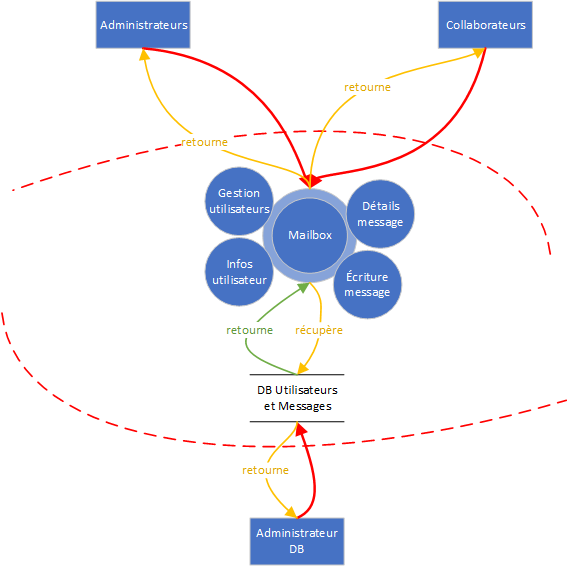

# STI : Projet 2 - Étude de menaces

Auteurs : Nicolas Ogi, Rebecca Tavaearai

Date : 09.12.2021

[TOC]

## Introduction

Dans le cadre du cours STI dispensé à la HEIG-VD, il nous a été demandé de réaliser une étude de menaces sur une application Web de messagerie électronique, développée lors d'un projet précédent.

Tout d'abord, ce document commence par la description du système dans sa globalité, de ses objectifs à son périmètre de sécurisation en passant par un digramme de flux. Ensuite, une identification des sources de menaces ainsi que des scénarios d'attaque. Finalement, l'identification des contre-mesures mises en place en fonction des différents scénarios d'attaque ainsi qu'une conclusion qui termine ce document.

## Description du système

### Objectif du système

L'application Web permet aux membres d'une entreprise, une fois authentifiés, de s'échanger des messages électroniques par l'intermédiaire d'une base de données. 

### Hypothèses de sécurité

Comme l'application est exécutée au sein d'une entreprise, on estime que le réseau interne, l'OS, le serveur Web et les administrateurs sont de confiance.

### Exigences de sécurité

- Seule la page de login doit être accessible sans être authentifié
- Seuls les administrateurs ont le droit d'ajouter, modifier ou supprimer un utilisateur
- Il ne doit pas être possible pour un utilisateur, peu importe son rôle, de pouvoir consulter les messages reçus d'un autre utilisateur
- La base de données contenant les informations associées aux utilisateurs doit absolument être protégée
- Un utilisateur, peu importe son rôle, ne doit pas pouvoir modifier ou supprimer un message après l'avoir envoyé (non-répudiation)
- Un utilisateur doit être défini comme "actif" pour pouvoir se connecter
- La page de gestion de la base de données de doit être accessible que par celui ou celle qui en connaît le mot de passe

### Éléments du système

- Application Web
- Base de données des utilisateurs

### Rôles des utilisateurs

- Collaborateurs (lecture et écriture de messages, changement du mot de passe personnel)
- Administrateurs (accès aux mêmes fonctionnalités que les collaborateurs + ajout, modification et suppression d'un utilisateur)

### DFD

### Identification des biens

- **Application Web de messagerie électronique** : Si elle venait à être attaquée, nous pourrions avoir des comptes utilisateurs usurpés afin de répandre de fausses informations aux autres utilisateurs et des désactivations ou suppressions de compte dans le cas où un compte Administrateur serait compromis. Nous avons donc une perte de confidentialité et d'intégrité.
- **Base de données contenant les messages des utilisateurs qui se connectent à l'application Web** : Si elle devait être compromise, un attaquant pourrait récupérer tous les messages échangés entre les utilisateurs. Pire, si la page de gestion de cette DB devait l'être aussi, l'attaquant pourrait également modifier voire supprimer les messages contenus, nous avons donc, dans ce cas-là, une perte totale de confidentialité et d'intégrité. Il pourrait même supprimer la DB toute entière, ce qui rendrait l'application Web indisponible.

### Définition du périmètre de sécurisation

???

## Identification des sources de menaces

Si l'application Web ne tourne qu'en interne dans l'entreprise et n'est accessible qu'à l'intérieur de celle-ci, il est clair que les sources de menaces principales sont les employés eux-mêmes. Cependant, différentes sources de menaces venant d'un réseau externe existent mais devraient dans un premier temps être capables d'entrer à l'intérieur du réseau de l'entreprise et éventuellement compromettre la machine d'un employé avant de pouvoir attaquer l'application Web, ce qui fait que leurs potentialités est plus faibles.

**Employé mécontent** :

- Motivation : Revanche, sabotage, divulgation d'informations sensibles sur l'entreprise, modification d'informations
- Cible : Base de données contenant les noms des utilisateurs et leurs messages (en y accédant directement ou via les mailboxes des autres employés)
- Potentialité : moyenne

**Employé malin** :

- Motivation : Espionner les messages des autres employés, obtenir des droits supplémentaires, faire une blague
- Cible : Base de données contenant les noms des utilisateurs et leurs messages (en y accédant directement ou via les mailboxes des autres employés), Page de gestion des administrateurs
- Potentialité : moyenne

**Hackers, script-kiddies** :

- Motivation : S'amuser, gloire
- Cible : N'importe quel élément / actif
- Potentialité : faible

**Cybercrime (spam, maliciels)** :

- Motivation : Financières

- Cible : Vol de credentials des employés, spam des employés, modification d'informations, phishing, revente d'informations

- Potentialité : faible

  

**Concurrent** :

- Motivation : Espionnage industriel
- Cible : Messages échangés entre les employés
- Potentialité : faible

## Identification des scénarios d'attaques

### Éléments du système attaqué

Les éléments cibles principaux sont les biens identifiés plus haut dans le document, la base de données contenant les informations des utilisateurs et leurs messages ainsi que l'application Web elle-mêmes.

### Motivation(s)

Les motivations ont été divisées en deux parties selon la cible.

- **Base de données** : 

  Dans le cas où la base de données est la cible de l'attaque, les motivations vont être de récupérer, modifier ou supprimer les données.

  - Récupération des données afin de les divulguer ou de les revendre
  - Modification de l'intégrité des données afin de perturber les échanges d'informations entre les employés (chiffrement par un ransomware)
  - Suppression des données afin de faire perdre du temps et de l'argent à l'entreprise

  

- **Application Web** :

  Dans le cas où l'application Web est la cible de l'attaque, les motivations vont être de la rendre inutilisable (DDoS) ou d'usurper l'identité d'un administrateur afin de tromper les employés. Elles pourraient également être la revente ou la divulgation de données sensibles contenues dans les mailboxes des employés dans le cas ou l'attaquant n'a pas réussi à accéder à la base de données directement.

### Scénario(s) d'attaque

1. Contourner le système d'autentification (login)
   Mot de passe faible, facilement trouvable (brute force)

      - Failles dans le mécanisme qui invalide l'authentification, par exemple une mauvaise gestion des exceptions.

   Contourner le formulaire (mauvaise validation des inputs)
   
2. Contourner le système d'autorisation
   Accéder à des pages sans les droits nécessaires (URL)
      - Vérifier que toutes les pages ont des contrôles
      - Vérifier que les contrôles soient bien fait
   
4. Injection SQL
   Lire ou écrire dans la db en injectant des commandes sql
      - Valider toutes les commandes sql
      - Attention au filtrage d'input
      
6. Cross site scripting

8. Attaque sur le serveur d'application

### STRIDE

#### Spoofing 
Exemple: s'authentifer à l'application en utilisant un mot de passe volé
Contre mesure:
  - politique de mot de passe
  - limiter le nombre de tentative de login
  - hacher les mots de passe dans la db avec (P)KDFs (Argon2)
  - ne pas mettre des messages d'erreur trop verbeux
  - utiliser POST plutôt que GET
  - utiliser https plutôt que http

#### Tampering 
Exemple: utiliser une injéction SQL pour modifier, supprimer ou récupérer des données dans la base de données
Contre mesure: use of prepared statements, escaping user input 

#### Repudiation 
Exemple: Modify a user shipping address on an e-commerce 
Contre mesure: request address confirmation and additional authentication to confirm 

#### Information disclosure 
Exemple: intercept clear-text browser traffic in a public wifi 
Contre mesure: traffic encryption 

#### Denial of service 
Exemple: allocate session memory based on user provided values 
Contre mesure: validate size before allocating (input validation) 

#### Elevation of privileges 
Exemple: copy/paste an administrative URL within a normal user session 
Contre mesure: authorization mechanism

## Identification des contre-mesures

### En fonction des scénarios d'attaques

## Conclusion

