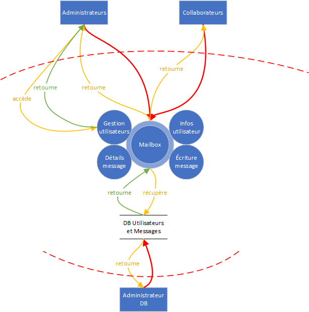

# STI : Projet 2 - Étude de menaces

Auteurs : Nicolas Ogi, Rebecca Tavaearai

Date : 22.12.2021

[TOC]

## Introduction

Dans le cadre du cours STI dispensé à la HEIG-VD, il nous a été demandé de réaliser une étude de menaces sur une application Web de messagerie électronique, développée lors d'un projet précédent.

Tout d'abord, ce document commence par la description du système dans sa globalité, de ses objectifs à son périmètre de sécurisation en passant par un digramme de flux. Ensuite, une identification des sources de menaces ainsi que des scénarios d'attaque. Finalement, l'identification des contre-mesures mises en place en fonction des différents scénarios d'attaque ainsi qu'une conclusion qui termine ce document.

## Description du système

### Objectif du système

L'application Web permet aux membres d'une entreprise, une fois authentifiés, de s'échanger des messages électroniques par l'intermédiaire d'une base de données. 

### Hypothèses de sécurité

Comme l'application est exécutée au sein d'une entreprise, on estime que le réseau interne, l'OS, le serveur Web et les administrateurs sont de confiance.

### Exigences de sécurité

- Seule la page de login doit être accessible sans être authentifié
- Seuls les administrateurs ont le droit d'ajouter, modifier ou supprimer un utilisateur
- Il ne doit pas être possible pour un utilisateur, peu importe son rôle, de pouvoir consulter les messages reçus d'un autre utilisateur
- La base de données contenant les informations associées aux utilisateurs doit absolument être protégée
- Un utilisateur, peu importe son rôle, ne doit pas pouvoir modifier ou supprimer un message après l'avoir envoyé (non-répudiation)
- Un utilisateur doit être défini comme "actif" pour pouvoir se connecter
- La page de gestion de la base de données de doit être accessible que par celui ou celle qui en connaît le mot de passe

### Éléments du système

- Application Web
- Base de données des utilisateurs

### Rôles des utilisateurs

- Collaborateurs (lecture et écriture de messages, changement du mot de passe personnel)
- Administrateurs (accès aux mêmes fonctionnalités que les collaborateurs + ajout, modification et suppression d'un utilisateur)

### DFD

### Identification des biens

- **Application Web de messagerie électronique** : Si elle venait à être attaquée, nous pourrions avoir des comptes utilisateurs usurpés afin de répandre de fausses informations aux autres utilisateurs et des désactivations ou suppressions de compte dans le cas où un compte Administrateur serait compromis. Nous avons donc une perte de confidentialité et d'intégrité.
- **Base de données contenant les messages des utilisateurs qui se connectent à l'application Web** : Si elle devait être compromise, un attaquant pourrait récupérer tous les messages échangés entre les utilisateurs. Pire, si la page de gestion de cette DB devait l'être aussi, l'attaquant pourrait également modifier voire supprimer les messages contenus, nous avons donc, dans ce cas-là, une perte totale de confidentialité et d'intégrité. Il pourrait même supprimer la DB toute entière, ce qui rendrait l'application Web indisponible.

### Définition du périmètre de sécurisation

Comme l'application ne serait accessible qu'en interne, le serveur sur laquelle elle s'exécute ne se situe pas dans une DMZ mais directement dans le réseau privé de l'entreprise. Ce qui veut dire que les données n'ont pas de périmètre de sécurité à franchir entre des zones de confiances différentes. Nous supposons que les fonctions d'administration doivent rester accessibles peu importe où l'on se trouve dans le réseau donc pas de limitations à certains VLAN ou plages d'IP.

## Identification des sources de menaces

Si l'application Web ne tourne qu'en interne dans l'entreprise et n'est accessible qu'à l'intérieur de celle-ci, il est clair que les sources de menaces principales sont les employés eux-mêmes. Cependant, différentes sources de menaces venant d'un réseau externe existent mais devraient dans un premier temps être capables d'entrer à l'intérieur du réseau de l'entreprise et éventuellement compromettre la machine d'un employé avant de pouvoir attaquer l'application Web, ce qui fait que leurs potentialités est plus faibles.

**Employé mécontent** :

- Motivation : Revanche, sabotage, divulgation d'informations sensibles sur l'entreprise, modification d'informations
- Cible : Base de données contenant les noms des utilisateurs et leurs messages (en y accédant directement ou via les mailboxes des autres employés)
- Potentialité : moyenne

**Employé malin ou curieux** :

- Motivation : Espionner les messages des autres employés, obtenir des droits supplémentaires, faire une blague
- Cible : Base de données contenant les noms des utilisateurs et leurs messages (en y accédant directement ou via les mailboxes des autres employés), Page de gestion des administrateurs
- Potentialité : moyenne

**Hackers, script-kiddies** :

- Motivation : S'amuser, gloire
- Cible : N'importe quel élément / actif
- Potentialité : faible

**Cybercrime (spam, maliciels)** :

- Motivation : Financières

- Cible : Vol de credentials des employés, spam des employés, modification d'informations, phishing, revente d'informations

- Potentialité : faible

  

**Concurrent** :

- Motivation : Espionnage industriel
- Cible : Messages échangés entre les employés
- Potentialité : faible

## Identification des scénarios d'attaques

### Éléments du système attaqué

Les éléments cibles principaux sont les biens identifiés plus haut dans le document, la base de données contenant les informations des utilisateurs et leurs messages ainsi que l'application Web elle-mêmes.

### Motivation(s)

Les motivations ont été divisées en deux parties selon la cible.

- **Base de données** : 

  Dans le cas où la base de données est la cible de l'attaque, les motivations vont être de récupérer, modifier ou supprimer les données.

  - Récupération des données afin de les divulguer ou de les revendre
  - Modification de l'intégrité des données afin de perturber les échanges d'informations entre les employés (chiffrement par un ransomware)
  - Suppression des données afin de faire perdre du temps et de l'argent à l'entreprise

  

- **Application Web** :

  Dans le cas où l'application Web est la cible de l'attaque, les motivations vont être de la rendre inutilisable (DDoS) ou d'usurper l'identité d'un administrateur afin de tromper les employés. Elles pourraient également être la revente ou la divulgation de données sensibles contenues dans les mailboxes des employés dans le cas ou l'attaquant n'a pas réussi à accéder à la base de données directement.

### Scénarios d'attaque

Les scénarios d'attaque listés ci-dessous sont basés sur les vulnérabilités identifiées lors de tests sur l'application Web. 

Comme l'application Web n'est accessible que depuis le réseau interne de l'entreprise, les sources de menace les plus probables sont surtout les personnes ayant accès au réseau interne et donc les employés eux-mêmes, c'est pour cela que ce sont les seules sources de menaces listés dans les différents scénarios d'attaque. Il est clair que des hackers, script-kiddies, le cybercrime voire des concurrents pourraient également faire partie des sources de menace mais la probabilité est plus faibles car ils devraient d'abord percer les défenses de l'entreprise afin de se retrouver dans le réseau interne de celle-ci.

#### 1. Contourner le système d'autentification afin d'avoir accès à la mailbox d'un employé 

- **Impact sur l'entreprise** : élevé (perte de confidentialité, d'intégrité et d'authenticité)

- **Sources de la menace** : employé mécontent ou malin

- **Motivation** : sabotage, divulgation d'information, curiosité

- **Actif(s) visé(s)** : mailboxes d'autres employés

- **Scénario d'attaque** :
  
  Comme aucune politique de mot de passe n'a été définie, il peut exister des mots de passe faibles et donc facilement trouvables. De plus, comme aucun moyen ne limite le nombre de tentatives infructueuses, un employé peut sans limite brute-forcer les credentials d'un autre employé et finalement réussir à se connecter à son compte. Pire, si le compte craqué appartient à un administrateur, l'attaquant pourrait avoir accès à la gestion des utilisateurs afin d'en ajouter des nouveaux, de supprimer ou modifier des existants.
  
- **Contrôles** :
  - Définir une politique de mots de passe forte (min. 8 caractères, min. 1 chiffre, min. 1 minuscule, min. 1 majuscule, min. 1 caractère spécial)
  - Limiter le nombre de tentatives infructueuses avant de désactiver le compte mais **attention** un attaquant pourrait profiter de cette contre-mesure pour bloquer les comptes des employés, ce qui ferait perdre du temps à l'entreprise pour réactiver les comptes
  - Limiter la vitesse des tentatives après un certains nombres de tentatives infructueuses
  - Bloquer l'IP de la source après plusieurs tentatives infructueuses
  
- **STRIDE** :

  Dans ce scénario, nous pouvons identifier les menaces suivantes :

  - Spoofing
  - Information disclosure

#### 2. Contourner le système d'autorisation afin d'accéder aux messages des autres employés

- **Impact sur l'entreprise** : moyen (perte de confidentialité)

- **Source de la menace** : employé malin ou curieux

- **Motivation** : curiosité

- **Actif(s) visé(s)** : messages envoyés par d'autres employés

- **Scénario d'attaque** :
  
  Une fois connecté, un employé peut très facilement manipuler les paramètres de l'URL afin d'accéder à des messages contenus dans la base de données qui ne lui appartiennent pas. Ainsi, il pourrait obtenir des informations confidentielles au sein de l'entreprise qui ne lui sont pas destinées.
  
- **Contrôles** :
  - Mettre en place un système d'autorisation qui empêche les employés d'accéder aux messages dont ils ne sont pas les destinataires.
  
- **STRIDE** :

  Dans ce scénario, nous pouvons identifier les menaces suivantes :

  - Information disclosure

#### 3. Récupération des données échangées entre les clients et le serveur en sniffant le trafic sur le réseau interne

- **Impact sur l'entreprise** : élevé (perte de confidentialité, d'intégrité et d'authenticité)

- **Source de la menace** : employé mécontent, malin ou curieux

- **Motivation** : sabotage, divulgation d'information, curiosité, usurpation d'identité

- **Actif(s) visé(s)** : toutes données transitant entre le serveur et les clients

- **Scénario d'attaque** :
  
  Comme l'application Web utilise HTTP pour échanger les données entre le client et le serveur, il est tout à fait possible de sniffer le réseau afin de récupérer les credentials d'un employé ou récupérer des messages envoyés à un autre employé. Un attaquant pourrait récupérer les credentials d'un administrateur, usurper son identité, accéder aux fonctionnalités supplémentaires (gestion admin). De manière plus active, il pourrait à l'aide d'un proxy d'interception, modifier la requête envoyée au serveur afin de porter atteinte à l'intégrité d'un message envoyé à un autre employé (en modifiant l'expéditeur d'un message par ex.). **A VERIFIER** : Avec ce même proxy, il pourrait également passer Administrateur en modifiant la requête lui permettant de changer son mot de passe.
  
- **Contrôles** :
  - Bien que cette contre-mesure ne sera pas mise en place dans le cadre de ce projet, la solution la plus efficace à ce problème de sécurité est de passer le serveur en HTTPS afin que tous les messages échangés soient chiffrés pour ainsi assurer la confidentialité, l'intégrité et l'authenticité.
  
- **STRIDE** :

  Dans ce scénario, nous pouvons identifier les menaces suivantes :

  - Spoofing
  - Tampering
  - Repudiation
  - Information disclosure
  - Elevation of privilege (**A VERIFIER**)

#### 4. Attaque Cross-Site Scripting

- **Impact sur l'entreprise** :

- **Sources de la menace** : 

- **Motivation** : 

- **Actif(s) visé(s)** : 

- **Scénario d'attaque** :

  

- **Contrôles** :

  - Assainir les inputs utilisateur pour éviter que des balises HTML soient interprétables

  

- **STRIDE** :

  Dans ce scénario, nous pouvons identifier les menaces suivantes :

  

#### 5. Attaque Cross-Site Request Forgery

- **Impact sur l'entreprise** :

- **Sources de la menace** : 

- **Motivation** : 

- **Actif(s) visé(s)** : 

- **Scénario d'attaque** :

  

- **Contrôles** :

  - Utiliser des tokens anti-CSRF dans les formulaires

  

- **STRIDE** :

  Dans ce scénario, nous pouvons identifier les menaces suivantes :

  

 #### 6. Injection SQL

- **Impact sur l'entreprise** :

- **Sources de la menace** : 

- **Motivation** : 

- **Actif(s) visé(s)** : 

- **Scénario d'attaque** :

  

- **Contrôles** :

  - Utiliser des prepare statements pour éviter les injections SQL dans les requêtes légitimes

  

- **STRIDE** :

  Dans ce scénario, nous pouvons identifier les menaces suivantes :

  

#### 7. Brute-force de la page de login de la base de données

- **Impact sur l'entreprise** : élevé (perte de confidentialité, d'intégrité et d'authenticité)

- **Sources de la menace** : employé mécontent ou malin

- **Motivation** : sabotage, divulgation d'information, curiosité

- **Actif(s) visé(s)** : base de données des utilisateurs et des messages

- **Scénario d'attaque** :

  Comme la page de gestion SQLite est accessible si l'on connait le nom de la ressource, un attaquant pourrait dans un premier temps brute-forcer les noms des fichiers accessibles via l'URL à l'aide de différents outils existants (ZAP, DirBuster, Burp Intruder, etc...) et ainsi obtenir l'arborescence du site. Puis, si une politique de mot de passe n'a pas vraiment été définie, il pourrait tenter de brute-forcer les credentials de la DB afin d'y accéder. Si l'accès est obtenu, il s'agit de la vulnérabilité la plus grave identifiée car un attaquant pourrait littéralement avoir accès à toutes les données de l'application et les copier, les supprimer ou les modifier. Il pourrait même supprimer la base de données entièrement et ainsi rendre l'application indisponible.

- **Contrôles** :

  - Définir une politique de mots de passe forte (min. 8 caractères, min. 1 chiffre, min. 1 minuscule, min. 1 majuscule, min. 1 caractère spécial)
  - Autoriser l'accès à la ressource que depuis une certaine IP (poste de l'administrateur DB) en modifiant les paramètres du serveur Nginx
  - Chiffrer les données stockées dans la base de données afin que même si elle est dump, aucune donnée n'est lisible sans la clé

- **STRIDE** :

  Dans ce scénario, nous pouvons identifier les menaces suivantes :

  - Spoofing
  - Tampering
  - Repudiation
  - Information disclosure
  - Denial of service
  - Elevation of privilege

  

## Identification des contre-mesures

Dans cette partie du rapport, nous listons les contre-mesures mises en place dans l'application par rapport aux différents scénarios d'attaque identifiés, avec des détails plus techniques concernant ce qui a dû être entrepris dans le code PHP :

#### 1. Mise en place d'une politique de mot de passe

#### 2. Vérification du rôle de l'utilisateur lors de l'accès à la base de données

#### 3. Sanitization des inputs utilisateurs

#### 4. Mise en place d'un token anti-CSRF dans les formulaires

#### 5. Préparation des requêtes SQL avant exécution

## Conclusion

